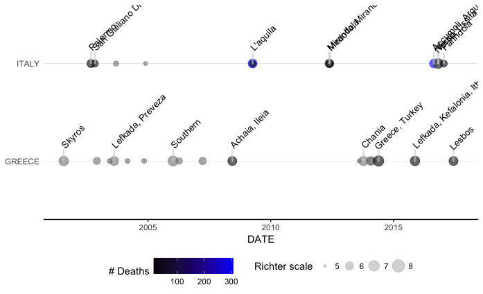
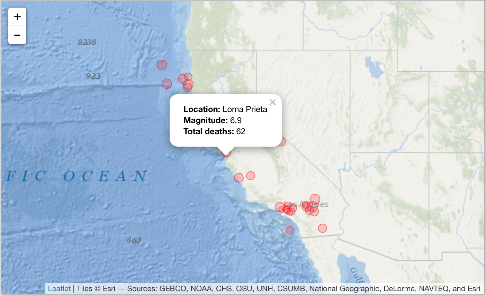

# NOAAearthquakeAnalysis

This package was created to analyse earthquake data from NOAA

[](https://travis-ci.org/RMHoek/NOAAearthquakeAnalysis)

## Description

The goal of NOAAearthquakeAnalysis is to facilitate access and aid in the analysis of the wealth of information embedded in the Significant Earthquake Database (SED) of the NOAA. This data can be found at <https://www.ngdc.noaa.gov/nndc/struts/results?type_0=Exact&query_0=$ID&t=101650&s=13&d=189&dfn=signif.txt> The functions contained in this package enable the user to clean the database to the essential variables, graph SED data on a time-line graph, and create interactive maps that can be annotated with SED data.

## Example of use of the functions in the NOAAearthquakeAnalysis package

This example shows the use of the SED dataset shipped as part of the package, how it is cleaned and used to plot a simple timeline graph and an interactive map.

```{r example}
library(readr)
library(dplyr)
library(magrittr)
library(ggplot2)
library(NOAAearthquakeAnalysis)
# use data available in package:
dataFile <- system.file("extdata", "earthquakes.tsv.gz", package = "NOAAearthquakeAnalysis")
theData <- readr::read_delim(dataFile, delim = "\t") %>% eq_clean_data()

# then use the data for a timeline plot:
dataFile %>% 
    dplyr::filter(COUNTRY %in% c("GREECE", "ITALY"), 
                  lubridate::year(DATE) > 2000) %>% 
    ggplot2::ggplot(ggplot2::aes(x = DATE, 
                                 y = COUNTRY, 
                                 color = TOTAL_DEATHS, 
                                 size = EQ_PRIMARY)) + 
    geom_timeline() + 
    geom_timeline_label(aes(label = LOCATION), n_max = 8) + 
    theme_timeline() + 
    ggplot2::scale_size(name = "Richter scale", limits = c(5, 8)) + 
    ggplot2::scale_color_gradient(name = "# Deaths", low = "black", high = "blue")

# or use the data to create an interactive map:
dataFile %>% 
    dplyr::filter(STATE == "CA" & lubridate::year(DATE) >= 1985) %>% 
    dplyr::mutate(popup_text = eq_create_label(.)) %>% 
    eq_map(annot_col = "popup_text")
```
The result of this in stills (the map produced in R is an interactive map with the markers clickable to reveal popup text balloons with extra info) is:






## Author

[RM Hoek](https://github.com/RMHoek)
